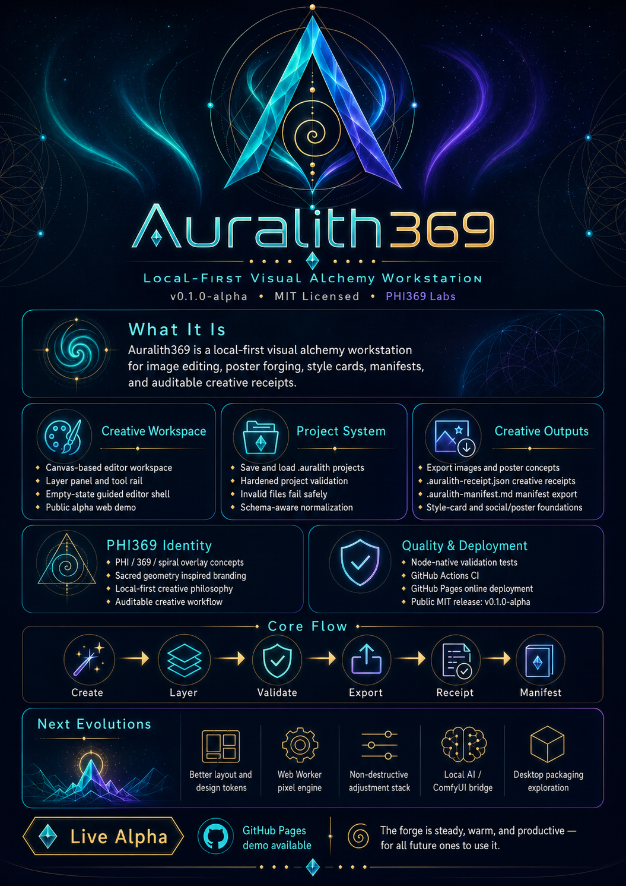

<p align="center">
  
</p>

<p align="center">
  <a href="https://michaelwave369.github.io/Auralith369/">Live Demo</a>
  ·
  <a href="RELEASE_NOTES_v0.7.4-alpha.md">Release Notes</a>
  ·
  <a href="docs/ALPHA_NOTES.md">Alpha Notes</a>
</p>

# Auralith369

**Local-first visual alchemy. Create locally. Prove the process.**

Auralith369 is a public-alpha creative workstation by PHI369 Labs for image editing, poster forging, style cards, manifests, and auditable creative receipts.

> ⚠️ **Alpha status:** This is alpha software. Auralith369 runs locally in your browser. Avoid opening untrusted `.auralith` project files until import validation is fully hardened. No warranty; MIT licensed.

## Parallax Creative Interop v2 Candidate

Auralith now carries the same frozen candidate interoperability profile as the downstream ParaCut/WaveForge chain:

```text
Domistika
→ Auralith369
→ ParaCut
→ WaveForgeStudio
```

Profile:

```text
parallax.creative-interop.v2
SHA-256 364448afa4997b4fb297a67e1d3cec73ec3bae500855ec21469a24df8ef01be0
```

Auralith CI recomputes the profile hash independently.

The optional CineSwarm release-reference extension remains unratified on the receiver side.

See [Parallax Creative Interop v2](docs/PARALLAX_CREATIVE_INTEROP_V2.md).

## v0.7.4-alpha — Observation Receipts + Style Intent

Acceptance 003 now leaves automatic evidence after verified import and finished capture.

```text
bridge import
→ auralith.observation-receipt.v1

capture
→ auralith.capture.png.v1
→ observation receipt
→ same-origin parallax creative evidence
```

Style Cards also expose machine-readable intent so agents can distinguish grades from strong surface transforms before applying them.

See [Observation Receipts + Style Intent](docs/OBSERVATION_RECEIPTS_V074.md).

## v0.7.3-alpha — Creative Bridge v2

Auralith now preserves protected Domistika layers separately from the gradeable base artwork.

```text
verified base raster
+ protected type / motion-ignore overlays
→ separate Auralith layers
→ base gets graded
→ protected overlays composite last
```

Creative Bridge v2 verifies base pixels, overlay pixels, and the canonical semantic manifest independently.

Stable SDK v0.1.2 adds:

```js
await Auralith.bridge.domistika.import()
```

and native site tools v0.1.2 add:

```text
auralith_import_domistika_transfer
```

Creative Bridge v1 remains supported.

See [Creative Bridge v2](docs/CREATIVE_BRIDGE_V2_V073.md) and [v0.7.3-alpha Release Notes](RELEASE_NOTES_v0.7.3-alpha.md).

## v0.7.2-alpha — Agent Capture + Acceptance 001

Auralith now has an agent-friendly finished-art readback contract:

```js
const capture = await Auralith.export.capture({
  maxDimension: 2048
})
```

It returns bounded PNG metadata plus base64/data-URL pixels, dimensions, byte count, SHA-256, and an explicit `authority: 'canvas2d'` marker.

The native site-tool layer also adds:

```text
auralith_capture_png
```

which returns a single base64 payload plus metadata instead of duplicating the same image as both base64 and data URL.

The first live Domistika → Auralith end-to-end run is preserved as **Native Creative Chain Acceptance 001**.

See [Agent Capture v0.7.2](docs/AGENT_CAPTURE_V072.md) and [Native Creative Chain Acceptance 001](docs/acceptance/NATIVE_CREATIVE_CHAIN_ACCEPTANCE_001.md).

## v0.7.1-alpha — Native WebMCP Site Tools

Auralith369 now exposes a compact native WebMCP tool layer over `window.Auralith`.

```text
browser agent
→ WebMCP
→ Auralith site tools
→ stable SDK
→ existing finishing workstation
```

The registered site tools cover live capabilities, command search/execution, layers, FX, LUTs, Style Cards, GPU cartridges, global adjustments, verified Domistika transfers, and creative receipts.

Domistika bridge site tools return metadata summaries and deliberately omit the base64 artwork payload from agent context.

Normal browsers without WebMCP continue to run Auralith unchanged.

See [Native WebMCP Site Tools](docs/WEBMCP_SITE_TOOLS_V071.md) and [v0.7.1-alpha Release Notes](RELEASE_NOTES_v0.7.1-alpha.md).

## v0.7.0-alpha — Stable SDK v0.1

Auralith369 now exposes a frozen semantic finishing-workstation API:

```js
window.Auralith
```

The live contract includes:

```js
Auralith.ready()
Auralith.capabilities()

Auralith.layers.*
Auralith.fx.*
Auralith.lut.*
Auralith.style.*
Auralith.adjustments.*
Auralith.gpu.*
Auralith.actions.*
Auralith.receipts.*
Auralith.bridge.domistika.*
Auralith.export.*
Auralith.commands.*
```

The API wraps the same workstation operations used by the human interface. It does not expose arbitrary JavaScript, raw Canvas/WebGL contexts, network fetch, or a bridge-integrity bypass.

Canvas 2D remains authoritative for projects, editing, receipts, and standard exports. GPU Lab remains an optional non-destructive finishing preview.

For integrations, use `Auralith.capabilities()` and the live command catalog rather than inferring features from README prose.

See [Stable SDK v0.1](docs/STABLE_SDK_V070.md) and [v0.7.0-alpha Release Notes](RELEASE_NOTES_v0.7.0-alpha.md).

## Features (Public Alpha)
- Canvas editor with local rendering
- Layer stack with opacity, masks, and blend modes
- Core tools: brush, move, crop, transform, and selection modes
- Filters/LUTs/gradient-map oriented workflow foundations
- Poster Forge + style card workflow
- PHI/369/sacred geometry overlays with snap system
- Caption tooling and dominant color extraction
- Project save/load (`.auralith`)
- Auralith Receipt export (`.auralith-receipt.json`)
- Auralith Manifest export (`.auralith-manifest.md`)
- Version snapshots and social pack export oriented pipeline
- Optional Three.js/WebGL2 GPU Lab with cartridges, CRT Signal, Aura Bloom, Display Physics, Feedback Chamber, Spectral Forge, and explicit GPU-frame export

## Current Stability Pass

The current branch includes a focused runtime and file-integrity pass:

- Restores the overlay registry used by the editor UI
- Makes files exported by Auralith369 valid inputs for its own importer
- Preserves exported canvas size, title, layer aliases, overlay, and snap state
- Restricts embedded project imagery to bounded base64 PNG, JPEG, or WebP data URLs
- Adds regression tests for runtime overlays and project round trips
- Integrates the new Auralith369 mark, favicon, social banner, and emulator-inspired interface polish

## GPU Lab boundary

GPU Lab is an optional non-destructive preview renderer. Canvas 2D remains authoritative for project files, editing tools, layers, masks, undo/redo, recovery, receipts, manifests, and standard exports. See `docs/GPU_LAB_ARCHITECTURE.md`.

## Local Setup
```bash
npm install
npm run dev
```
Open the local URL printed by Vite.

## Development Commands
```bash
npm run dev
npm run build
npm run preview
```

## Install / Dev / Test / Build
```bash
npm install
npm run dev
npm test
npm run build
```

## File Formats
- Project: `.auralith`
- Receipt: `.auralith-receipt.json`
- Manifest: `.auralith-manifest.md`
- GPU cartridge: `.auralith-gpu.json`

See docs:
- `docs/FILE_FORMAT.md`
- `docs/RECEIPTS.md`
- `docs/MANIFESTS.md`
- `docs/STYLE_CARDS.md`
- `docs/GPU_CARTRIDGE_BAY.md`
- `docs/GPU_DISPLAY_PHYSICS.md`
- `docs/GPU_FEEDBACK_CHAMBER.md`
- `docs/GPU_SPECTRAL_FORGE.md`

## Visual Identity

<p align="center">
  
</p>

The new mark is used in the application chrome and browser favicon. The shell intentionally borrows the compact, tactile workstation energy of classic SNES-era emulator interfaces while keeping Auralith369’s own visual identity.

## Screenshots

Full workflow screenshots are the next documentation pass. The live demo is the current interactive reference.

## Visual Overview

<p align="center">
  
</p>

[View infographic poster](./auralith369-infographic-poster.png)

The infographic summarizes the alpha feature set, project format, validation flow, deployment status, and next planned evolutions.

## GPU Spectral Forge (v0.6.0-alpha)

GPU Lab v0.5 adds Prism Drift and Spectral Forge: radial RGB dispersion, hue rotation, saturation shaping, shadow/highlight duotone mapping, solarization, and six safe channel-remap modes. Two new built-in cartridges—**Prism Oracle** and **Solarized Reliquary**—join the Cartridge Bay. Older cartridges remain compatible through neutral normalized defaults, and the full spectral state is preserved in projects, recovery, receipts, manifests, and portable cartridge JSON.

## GPU Cartridge Bay and Feedback Chamber (v0.5.0-alpha)

GPU Lab v0.4 adds ten local signal cartridges, Display Physics, and a true ping-pong Feedback Chamber with recursive decay, zoom, rotation, offset, mirror, kaleidoscope, blend, and safe frame-buffer clearing. Custom cartridges, JSON import/export, comparison, recovery, receipts, and manifests preserve the full parameter state. Canvas 2D remains authoritative.

## GPU Display Physics (v0.4.0-alpha)

GPU Lab v0.3 adds phosphor mask simulation, scanline softness, signal ghosting, brightness compensation, black-crush shaping, and highlight rolloff. Every control is normalized, stored inside cartridges, project files, recovery snapshots, receipts, and manifests, and rendered without replacing the Canvas 2D authority layer.

## Roadmap
See `ROADMAP.md`.

## License
MIT (`LICENSE`). No warranty.

## Attribution
Auralith369 is built by **PHI369 Labs**.

## Quality Checks

- Smoke check: if the app shows an **Auralith369 runtime error** panel, open browser console and report the displayed error.

```bash
npm install
npm test
npm run build
npm run dev
```

## Online Demo

Auralith369 is deployed with GitHub Pages at:

https://michaelwave369.github.io/Auralith369/

If the online demo shows only a blank background, open DevTools Console and report any message from:
- Auralith369 failed to boot
- Auralith369 runtime error
